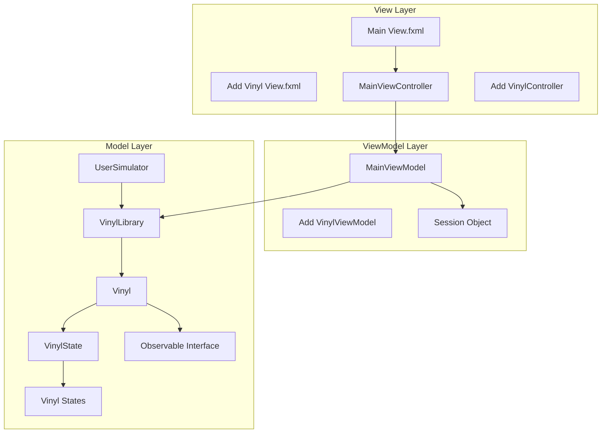
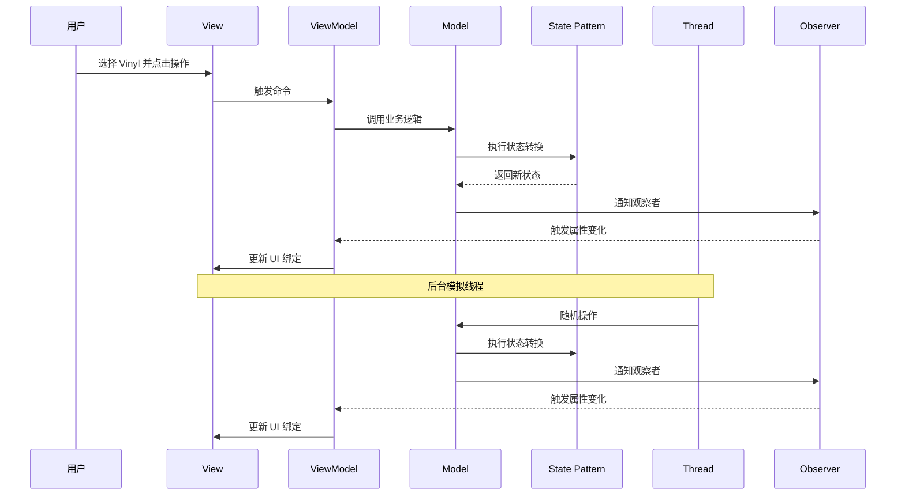
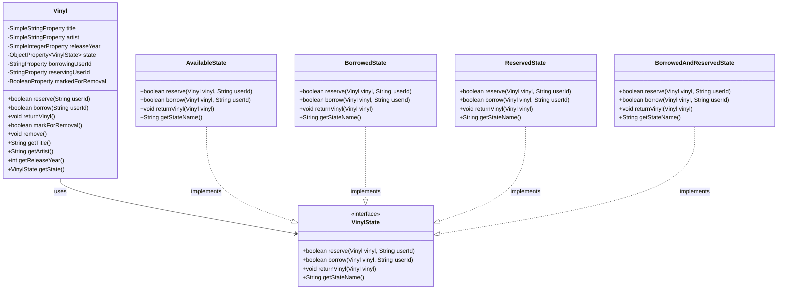
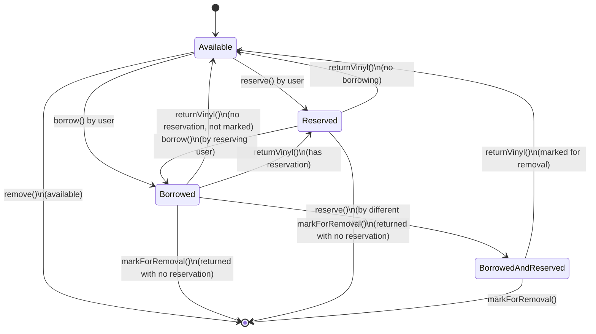

# Vinyl Library System Design

Feature Name: 260302-vinyl-library
Updated: 2026-03-02

## Description

Vinyl Library System 是一个基于 JavaFX 的桌面应用程序,用于管理黑胶唱片图书馆。系统采用 MVVM 架构模式,实现了多用户并发操作、状态管理和实时 GUI 更新功能。用户可以浏览、预约、借阅、归还和移除黑胶唱片,同时系统通过 Runnable 线程模拟其他用户的随机操作。

## Architecture

系统采用三层架构,严格遵循 MVVM 设计模式,并结合 Observer 和 State 设计模式实现动态更新和状态管理。

### Layer Architecture



### Component Interactions



## Components and Interfaces

### Model Layer

#### Vinyl (模型类)

**职责**: 表示单个黑胶唱片实体,包含基本属性和状态管理。

**属性**:
- `SimpleStringProperty title` - 唱片标题
- `SimpleStringProperty artist` - 艺术家
- `SimpleIntegerProperty releaseYear` - 发行年份
- `ObjectProperty<VinylState> state` - 当前状态对象
- `StringProperty borrowingUserId` - 借阅用户 ID
- `StringProperty reservingUserId` - 预约用户 ID
- `BooleanProperty markedForRemoval` - 是否标记为待移除

**方法**:
```java
// 状态操作方法
public boolean reserve(String userId)
public boolean borrow(String userId)
public void returnVinyl()
public boolean markForRemoval()
public void remove()

// 状态查询方法
public boolean isAvailable()
public boolean isBorrowed()
public boolean isReserved()
public boolean canBorrow(String userId)
public boolean canReserve(String userId)

// 访问器方法
public String getTitle()
public String getArtist()
public int getReleaseYear()
public VinylState getState()
```

#### VinylState (状态接口)

**职责**: 定义状态模式的接口,所有具体状态类实现此接口。

**方法**:
```java
public boolean reserve(Vinyl vinyl, String userId);
public boolean borrow(Vinyl vinyl, String userId);
public void returnVinyl(Vinyl vinyl);
public String getStateName();
```

#### 具体状态类

**AvailableState** (可用状态):
- 实现 `reserve()`: 如果未被预约,设置状态为 ReservedState
- 实现 `borrow()`: 设置状态为 BorrowedState,记录借阅用户
- 实现 `returnVinyl()`: 无操作(已在可用状态)

**BorrowedState** (已借阅状态):
- 实现 `reserve()`: 如果未被预约,允许预约,记录预约用户
- 实现 `borrow()`: 只有预约用户可以借阅
- 实现 `returnVinyl()`: 检查是否标记移除,如有预约则转换为 ReservedState,否则转换为 AvailableState

**ReservedState** (已预约状态):
- 实现 `reserve()`: 拒绝新预约
- 实现 `borrow()`: 只有预约用户可以借阅
- 实现 `returnVinyl()`: 无操作(此状态不会直接触发)

**BorrowedAndReservedState** (已借阅且已预约状态):
- 实现 `reserve()`: 拒绝新预约
- 实现 `borrow()`: 只有预约用户可以借阅
- 实现 `returnVinyl()`: 转换为 AvailableState

#### VinylLibrary (管理类)

**职责**: 管理 Vinyl 集合,提供业务逻辑方法。

**属性**:
- `ObservableList<Vinyl> vinyls` - 可观察的 Vinyl 列表
- `List<Observer> observers` - 观察者列表

**方法**:
```java
// Vinyl 管理
public void addVinyl(String title, String artist, int year)
public void removeVinyl(Vinyl vinyl)
public ObservableList<Vinyl> getVinyls()

// 操作方法
public boolean reserveVinyl(Vinyl vinyl, String userId)
public boolean borrowVinyl(Vinyl vinyl, String userId)
public void returnVinyl(Vinyl vinyl, String userId)
public boolean markVinylForRemoval(Vinyl vinyl)

// 观察者模式
public void addObserver(Observer observer)
public void removeObserver(Observer observer)
public void notifyObservers()
```

#### UserSimulator (模拟器类)

**职责**: 实现 Runnable 接口,模拟其他用户的随机操作。

**属性**:
- `VinylLibrary library` - 图书馆引用
- `String userId` - 模拟用户 ID
- `boolean running` - 运行标志
- `Random random` - 随机数生成器

**方法**:
```java
public void run()
public void stop()
private void performRandomAction()
private Vinyl selectRandomVinyl()
```

### ViewModel Layer

#### MainViewModel

**职责**: 连接 Model 和 View,提供数据绑定和命令处理。

**属性**:
- `ObjectProperty<Vinyl> selectedVinyl` - 当前选中的 Vinyl
- `StringProperty currentUserId` - 当前用户 ID
- `ObservableList<Vinyl> vinylList` - Vinyl 列表(绑定到 Model)
- `BooleanProperty canReserve` - 是否可以预约
- `BooleanProperty canBorrow` - 是否可以借阅
- `BooleanProperty canReturn` - 是否可以归还
- `BooleanProperty canRemove` - 是否可以移除

**命令**:
- `Command reserveCommand` - 预约命令
- `Command borrowCommand` - 借阅命令
- `Command returnCommand` - 归还命令
- `Command removeCommand` - 移除命令

**方法**:
```java
// 数据绑定
public void bindToModel(VinylLibrary library)
public void onVinylSelected(Vinyl vinyl)
public void updateActionStates()

// 命令处理
public void reserve()
public void borrow()
public void return_()
public void remove()

// 观察者通知
public void onVinylStateChanged(Vinyl vinyl)
```

#### AddVinylViewModel

**职责**: 处理添加新 Vinyl 的表单逻辑。

**属性**:
- `StringProperty title` - 输入的标题
- `StringProperty artist` - 输入的艺术家
- `IntegerProperty releaseYear` - 输入的发行年份
- `BooleanProperty isValid` - 表单是否有效

**方法**:
```java
public void addVinyl()
public void validateForm()
public void clearForm()
```

#### Session

**职责**: 存储跨视图共享的应用状态。

**属性**:
- `StringProperty currentUserId` - 当前登录用户 ID
- `ObjectProperty<Vinyl> selectedVinyl` - 全局选中的 Vinyl

**方法**:
```java
public String getCurrentUserId()
public void setCurrentUserId(String userId)
public Vinyl getSelectedVinyl()
public void setSelectedVinyl(Vinyl vinyl)
```

### View Layer

#### MainViewController

**职责**: 处理用户界面事件,与 ViewModel 交互。

**FXML 绑定**:
- `TableView<Vinyl> vinylTable` - Vinyl 列表表格
- `TableColumn<Vinyl, String> titleColumn` - 标题列
- `TableColumn<Vinyl, String> artistColumn` - 艺术家列
- `TableColumn<Vinyl, Integer> yearColumn` - 发行年份列
- `TableColumn<Vinyl, String> stateColumn` - 状态列
- `Button reserveButton` - 预约按钮
- `Button borrowButton` - 借阅按钮
- `Button returnButton` - 归还按钮
- `Button removeButton` - 移除按钮
- `Button addVinylButton` - 添加 Vinyl 按钮
- `Button startSimulationButton` - 启动模拟按钮
- `Button stopSimulationButton` - 停止模拟按钮

**方法**:
```java
public void initialize()
public void onReserveClicked()
public void onBorrowClicked()
public void onReturnClicked()
public void onRemoveClicked()
public void onAddVinylClicked()
public void onStartSimulationClicked()
public void onStopSimulationClicked()
```

#### AddVinylController

**职责**: 处理添加 Vinyl 表单。

**FXML 绑定**:
- `TextField titleField` - 标题输入框
- `TextField artistField` - 艺术家输入框
- `TextField yearField` - 发行年份输入框
- `Button saveButton` - 保存按钮
- `Button cancelButton` - 取消按钮

**方法**:
```java
public void initialize()
public void onSaveClicked()
public void onCancelClicked()
```

## Data Models

### Vinyl 数据结构



### 状态机图



## Correctness Properties

### 不变量(Invariants)

1. **Vinyl 状态唯一性**: 每个 Vinyl 在任何时刻只能处于一个明确的状态
2. **用户唯一借阅**: 一个用户一次只能借阅一个 Vinyl
3. **预约唯一性**: 一个 Vinyl 最多只能被一个用户预约
4. **借阅与预约关联**: 只有预约用户可以借阅已预约的 Vinyl
5. **移除状态一致性**: 被标记移除的 Vinyl 不能接受新的预约
6. **可观察性一致性**: 所有状态变化必须通知所有注册的观察者

### 线程安全属性

1. **原子性**: 每个操作(预约、借阅、归还、移除)必须是原子的
2. **一致性**: 多线程环境下,Vinyl 状态必须保持一致
3. **可见性**: 状态变化对所有线程立即可见
4. **互斥**: 临界区必须被正确保护,防止竞态条件

### 状态转换规则

1. **Available → Reserved**: 仅当 Vinyl 无预约时
2. **Available → Borrowed**: 无条件允许
3. **Borrowed → Available**: 仅当无预约且未标记移除
4. **Borrowed → Reserved**: 仅当有预约
5. **Reserved → Borrowed**: 仅当操作者是预约用户
6. **Reserved → Available**: 仅当无借阅

## Error Handling

### 异常场景

1. **预约失败场景**:
   - 用户尝试预约已预约的 Vinyl → 显示错误提示"此唱片已被其他用户预约"
   - 用户尝试预约自己已预约的 Vinyl → 显示错误提示"您已经预约了此唱片"

2. **借阅失败场景**:
   - 用户尝试借阅他人预约的 Vinyl → 显示错误提示"此唱片已被其他用户预约"
   - 用户尝试借阅已借阅的 Vinyl → 显示错误提示"此唱片已被借出"
   - 用户超过借阅限制 → 显示错误提示"您已达到最大借阅数量"

3. **归还失败场景**:
   - 用户尝试归还未借阅的 Vinyl → 显示错误提示"您未借阅此唱片"
   - 用户尝试归还他人借阅的 Vinyl → 显示错误提示"此唱片不是您借阅的"

4. **移除失败场景**:
   - 用户尝试移除有预约的 Vinyl → 标记为待移除,显示提示"将在归还后移除"
   - 用户尝试移除已借阅的 Vinyl → 标记为待移除,显示提示"将在归还后移除"

5. **并发冲突场景**:
   - 多个用户同时操作同一 Vinyl → 使用同步锁确保操作顺序,显示"操作已排队"

### 错误处理策略

1. **输入验证**: 在 ViewModel 层验证用户输入,防止无效数据
2. **状态检查**: 在执行操作前检查当前状态是否符合要求
3. **异常捕获**: 捕获所有运行时异常,记录日志并显示友好的用户消息
4. **事务回滚**: 如果操作失败,回滚到操作前的状态
5. **通知机制**: 使用 JavaFX Alert 显示错误和警告信息

## Test Strategy

### 单元测试

1. **状态模式测试**:
   - 测试每个状态类的方法
   - 验证状态转换的正确性
   - 测试边界条件(如空预约、标记移除)

2. **Model 测试**:
   - 测试 Vinyl 的 reserve、borrow、return、remove 方法
   - 测试 VinylLibrary 的 CRUD 操作
   - 测试观察者通知机制

3. **ViewModel 测试**:
   - 测试数据绑定是否正确
   - 测试命令执行逻辑
   - 测试操作状态(canReserve、canBorrow 等)

4. **Session 测试**:
   - 测试跨视图数据共享
   - 测试用户 ID 和选中 Vinyl 的存储

### 集成测试

1. **MVVM 集成测试**:
   - 测试 Model、ViewModel、View 之间的交互
   - 测试数据流从 Model 到 View 的正确传递

2. **观察者模式集成测试**:
   - 测试状态变化是否正确通知所有观察者
   - 测试 GUI 是否实时更新

### 并发测试

1. **多线程测试**:
   - 模拟多个用户同时操作
   - 测试线程安全性
   - 测试数据一致性

2. **竞态条件测试**:
   - 创建竞争场景(多个线程同时预约同一 Vinyl)
   - 验证系统正确处理并发请求

### GUI 测试

1. **手动测试**:
   - 测试所有按钮功能
   - 测试表格显示和排序
   - 测试表单验证

2. **自动测试**:
   - 使用 TestFX 框架测试 UI 交互
   - 测试窗口打开和关闭

## References

[^1]: (Website) - [MVVM Design Pattern](https://viaucdk-my.sharepoint.com/:p:/g/personal/mivi_viauc_dk/ERq-HZanan1Il1qIAgibr28Bvv_fs64vBv-Q48cMdCEstA?rtime=EY6Qnpo23Eg)
[^2]: (Website) - [Observer Design Pattern](https://viaucdk-my.sharepoint.com/:p:/g/personal/mivi_viauc_dk/EW35KX6HbzpOj9uJJOxxF00BQxuuh_EeSaFIzDn5nzYDNw?e=kHo1Xg)
[^3]: (Website) - [State Design Pattern](https://viaucdk-my.sharepoint.com/:p:/g/personal/mivi_viauc_dk/EXeIwrpqCK1Loz0nLvJO0vABIJ7RTkgwu8lwE_mVMxd7lQ?e=twxGB9)
[^4]: (Website) - [Threads in Java](https://viaucdk-my.sharepoint.com/:p:/g/personal/mivi_viauc_dk/EbYBFs9lT9RMvkFDfAi-XToB1_R-Mc1jidlOCN8rGuDixA?e=doN9da)
[^5]: (Documentation) - [JavaFX Documentation](https://openjfx.io/)
[^6]: (Documentation) - [Java Observable Pattern](https://docs.oracle.com/javase/8/docs/api/java/util/Observable.html)
