# Vinyl Library - UML Class Diagram

## Overview
本文档包含 Vinyl Library 系统的完整 UML 类图，基于最终实现的代码结构。现有的代码结构为唯一的事实来源（Source of Truth）。

## Package Structure

```
com.vinyl.assignment1
├── model
│   ├── Vinyl.java
│   ├── VinylState.java
│   ├── AvailableState.java
│   ├── BorrowedState.java
│   ├── ReservedState.java
│   ├── BorrowedAndReservedState.java
│   ├── VinylLibrary.java
│   ├── UserSimulator.java
│   └── Session.java
├── viewmodel
│   ├── MainViewModel.java
│   └── AddVinylViewModel.java
├── view
│   ├── MainViewController.java
│   └── AddVinylController.java
└── util
    ├── Observer.java
    └── Observable.java
```

## Complete UML Class Diagram

```mermaid
classDiagram
    %% Model Layer
    class Vinyl {
        -StringProperty title
        -StringProperty artist
        -IntegerProperty releaseYear
        -ObjectProperty~VinylState~ state
        -StringProperty borrowingUserId
        -StringProperty reservingUserId
        -BooleanProperty markedForRemoval
        +Vinyl(String title, String artist, int releaseYear)
        +String getTitle()
        +void setTitle(String newTitle)
        +StringProperty titleProperty()
        +String getArtist()
        +void setArtist(String newArtist)
        +StringProperty artistProperty()
        +int getReleaseYear()
        +void setReleaseYear(int newReleaseYear)
        +IntegerProperty releaseYearProperty()
        +VinylState getState()
        +void setState(VinylState newState)
        +ObjectProperty~VinylState~ stateProperty()
        +String getBorrowingUserId()
        +void setBorrowingUserId(String userId)
        +StringProperty borrowingUserIdProperty()
        +String getReservingUserId()
        +void setReservingUserId(String userId)
        +StringProperty reservingUserIdProperty()
        +boolean isMarkedForRemoval()
        +void setMarkedForRemoval(boolean marked)
        +BooleanProperty markedForRemovalProperty()
        +boolean isReserved()
        +boolean isBorrowed()
        +boolean reserve(String userId)
        +boolean borrow(String userId)
        +void returnVinyl()
    }

    class VinylState {
        <<interface>>
        +boolean reserve(Vinyl vinyl, String userId)
        +boolean borrow(Vinyl vinyl, String userId)
        +void returnVinyl(Vinyl vinyl)
        +String getStateName()
    }

    class AvailableState {
        +boolean reserve(Vinyl vinyl, String userId)
        +boolean borrow(Vinyl vinyl, String userId)
        +void returnVinyl(Vinyl vinyl)
        +String getStateName()
    }

    class BorrowedState {
        +boolean reserve(Vinyl vinyl, String userId)
        +boolean borrow(Vinyl vinyl, String userId)
        +void returnVinyl(Vinyl vinyl)
        +String getStateName()
    }

    class ReservedState {
        +boolean reserve(Vinyl vinyl, String userId)
        +boolean borrow(Vinyl vinyl, String userId)
        +void returnVinyl(Vinyl vinyl)
        +String getStateName()
    }

    class BorrowedAndReservedState {
        +boolean reserve(Vinyl vinyl, String userId)
        +boolean borrow(Vinyl vinyl, String userId)
        +void returnVinyl(Vinyl vinyl)
        +String getStateName()
    }

    class VinylLibrary {
        -ObservableList~Vinyl~ vinyls
        -List~Observer~ observers
        +VinylLibrary()
        +void addVinyl(Vinyl vinyl)
        +void addVinyl(String title, String artist, int year)
        +void removeVinyl(Vinyl vinyl)
        +ObservableList~Vinyl~ getVinyls()
        +void reserveVinyl(Vinyl vinyl, String userId)
        +void borrowVinyl(Vinyl vinyl, String userId)
        +void returnVinyl(Vinyl vinyl, String userId)
        +void markVinylForRemoval(Vinyl vinyl)
        +void addObserver(Observer o)
        +void removeObserver(Observer o)
        -void notifyObservers(Vinyl vinyl)
    }

    class UserSimulator {
        -VinylLibrary library
        -String userId
        -boolean running
        -Random random
        +UserSimulator(VinylLibrary library, String userId)
        +void start()
        +void stop()
        +void run()
    }

    class Session {
        -static Session instance
        -String username
        -Session()
        +static Session getInstance()
        +String getUsername()
        +void setUsername(String username)
    }

    %% ViewModel Layer
    class MainViewModel {
        -VinylLibrary library
        -ObservableList~Vinyl~ vinylList
        +MainViewModel(VinylLibrary library)
        +ObservableList~Vinyl~ getVinylList()
        +VinylLibrary getLibrary()
        +void update(Vinyl vinyl)
        -void updateVinylList()
        +void reserveVinyl(Vinyl vinyl)
        +void borrowVinyl(Vinyl vinyl)
        +void returnVinyl(Vinyl vinyl)
        +void markForRemoval(Vinyl vinyl)
    }

    class AddVinylViewModel {
        -VinylLibrary library
        -StringProperty title
        -StringProperty artist
        -StringProperty releaseYear
        -StringProperty errorLabel
        +AddVinylViewModel(VinylLibrary library)
        +String getTitle()
        +void setTitle(String t)
        +StringProperty titleProperty()
        +String getArtist()
        +void setArtist(String a)
        +StringProperty artistProperty()
        +String getReleaseYear()
        +void setReleaseYear(String ry)
        +StringProperty releaseYearProperty()
        +String getErrorLabel()
        +void setErrorLabel(String e)
        +StringProperty errorLabelProperty()
        +boolean addVinyl()
        -void clearForm()
    }

    %% View Layer
    class MainViewController {
        -MainViewModel viewModel
        -UserSimulator simulator
        -Label currentUserLabel
        -TableView~Vinyl~ vinylTable
        -TableColumn~Vinyl, String~ titleColumn
        -TableColumn~Vinyl, String~ artistColumn
        -TableColumn~Vinyl, Number~ yearColumn
        -TableColumn~Vinyl, String~ stateColumn
        -Button reserveButton
        -Button borrowButton
        -Button returnButton
        -Button removeButton
        -Button addVinylButton
        -Button startSimulationButton
        -Button stopSimulationButton
        +void setViewModel(MainViewModel viewModel)
        +void setSimulator(UserSimulator simulator)
        +void initialize()
        +void onReserveClicked()
        +void onBorrowClicked()
        +void onReturnClicked()
        +void onRemoveClicked()
        +void onAddVinylClicked()
        +void onStartSimulationClicked()
        +void onStopSimulationClicked()
    }

    class AddVinylController {
        -AddVinylViewModel viewModel
        -Stage stage
        -TextField titleField
        -TextField artistField
        -TextField yearField
        -Label errorLabel
        -Button saveButton
        -Button cancelButton
        +void setViewModel(AddVinylViewModel viewModel, Stage stage)
        +void onSaveClicked()
        +void onCancelClicked()
    }

    %% Utility
    class Observer {
        <<interface>>
        +void update(Vinyl vinyl)
    }

    class Observable {
        <<interface>>
        +void addObserver(Observer o)
        +void removeObserver(Observer o)
    }

    %% Main Application
    class HelloApplication {
        -UserSimulator simulator
        +void start(Stage stage)
        +void stop()
        +static void main(String[] args)
    }

    %% Relationships
    Vinyl --> VinylState : uses
    VinylState <|.. AvailableState : implements
    VinylState <|.. BorrowedState : implements
    VinylState <|.. ReservedState : implements
    VinylState <|.. BorrowedAndReservedState : implements
    
    VinylLibrary --> Vinyl : manages
    VinylLibrary ..|> Observable : implements
    VinylLibrary --> Observer : notifies
    
    UserSimulator --> VinylLibrary : runs operations on
    UserSimulator ..|> Runnable : implements
    
    MainViewModel --> VinylLibrary : uses library layer
    MainViewModel --> Session : reads current user
    MainViewModel ..|> Observer : implements
    
    AddVinylViewModel --> VinylLibrary : adds vinyl to
    
    MainViewController --> MainViewModel : binds actions to
    MainViewController --> UserSimulator : controls lifecycle of
    
    AddVinylController --> AddVinylViewModel : binds actions to
    
    HelloApplication --> VinylLibrary : initializes
    HelloApplication --> UserSimulator : initializes
    HelloApplication --> MainViewModel : initializes
    HelloApplication --> MainViewController : injects dependencies
```


